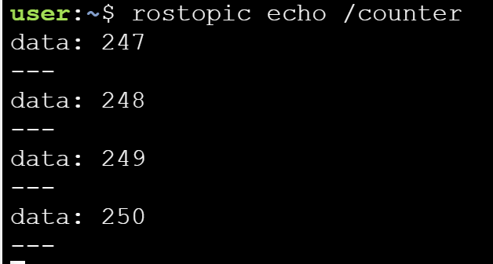

> ## 학습할 내용
1. Publish를 위한 패키지 생성과 C++, std_msgs 의존성 추가
2. Launch파일 작성
3. CMakeList.txt 파일 수정 및 컴파일

---

## 1. 패키지 생성
```
$ catkin_create_pkg topic_publisher_pkg roscpp std_msgs
```
- c++와 std_msgs를 의존성으로 갖는 패키지 생성
- 필자는 std_msgs를 std_msg로 적어 빌드가 되지 않는 문제가 있었는데, 새로 패키지를 만들기보다는 CMakeList.txt에서 해당 부분을 수정하며 해결하였음

>CMakeList.txt
``` java
find_package(catkin REQUIRED COMPONENTS
  roscpp
  std_msg -> std_msgs
)
``` 
- 위 CMake txt파일에 컴파일을 위한 해당 내용 추가
``` java
add_executable(simple_topic_publisher src/simple_topic_publisher.cpp)
add_dependencies(simple_topic_publisher ${simple_topic_publisher_EXPORTED_TARGETS} ${catkin_EXPORTED_TARGETS})
target_link_libraries(simple_topic_publisher
   ${catkin_LIBRARIES}
 )
```

## 2. C++ 파일 작성

``` cpp
#include <ros/ros.h>
#include <std_msgs/Int32.h>

int main(int argc, char** argv) {

    ros::init(argc, argv, "topic_publisher");
    ros::NodeHandle nh;
    
    ros::Publisher pub = nh.advertise<std_msgs::Int32>("counter", 1000);
    ros::Rate loop_rate(2);
    
    std_msgs::Int32 count;
    count.data = 0;
    
    while (ros::ok())
    {
        pub.publish(count);
        ros::spinOnce();
        loop_rate.sleep();
        ++count.data;
    }
    
    return 0;
}
```
- init 함수를 통해 ROS 노드를 초기화하며 노드 이름은 topic_publisher임 
- 초당 2초의 주기로 루프를 실행하는 스크립트임
- counter 토픽은 최대 1000개의 메시지를 저장 가능함

> publisher.launch 파일은 다음과 같이 작성
``` xml
<launch>
    <!-- My Package launch file -->
    <node pkg="topic_publisher_pkg" type="simple_topic_publisher" name="counter"  output="screen">
    </node>
</launch>
```

---
## 3. 실행

- catkin_ws에서 catkin_make 진행 후 런치파일 실행
```
$ user:~/catkin_ws$ roslaunch topic_publisher_pkg publisher.launch
```
- 그리고 다음 명령을 통해 /counter 토픽이 실행 중임을 확인할 수 있음
```
user ~ $ rostopic list | grep '/counter'
/counter
```

- 다음 명령을 통해 토픽에 대한 정보를 확인할 수 있음

```
user ~ $ rostopic info /counter
Type: std_msgs/Int32

Publishers:
 * /topic_publisher (http://ip-172-31-16-133:47971/)

Subscribers: None
```

